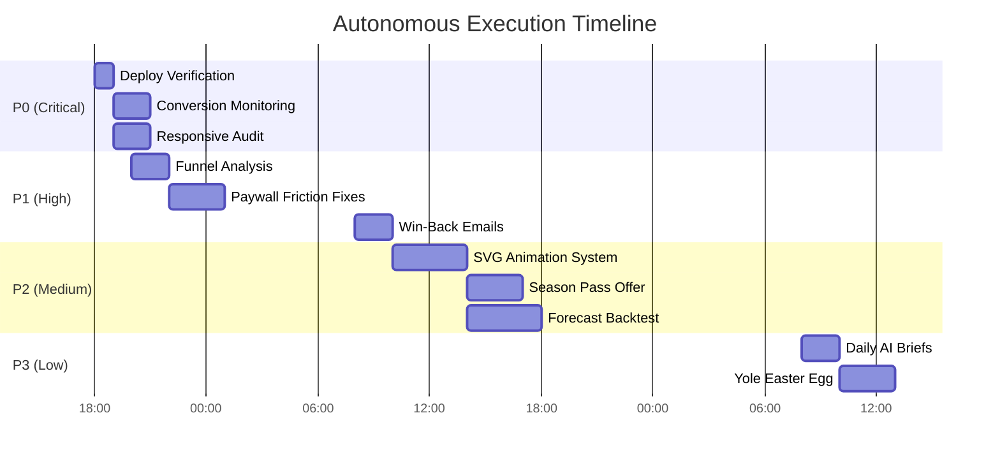

# MASTER_AGENT_PLAN.md — Autonomous Execution Roadmap

> **Source**: AGENTS.md, CLAUDE.md, `.ai/current_state.md`
> **Status**: [~] in_progress
> **Next Handoff**: 2026-08-17 18:00 UTC

---

## 🎯 Strategic Objectives
1. **Conversion**: 0.009% → 0.02% (map → paid)
2. **Distribution**: US SEO (Florida/Punta Cana) → 10x traffic
3. **Monetization**: B2B hotels + AI features → 10x ARPU
4. **Retention**: 7d/30d retention >30%

---

## 🤖 Agent Matrix
| Agent               | Priority | Current Task                          | Next Task                          | Handoff To               |
|--------------------|----------|---------------------------------------|------------------------------------|--------------------------|
| **product_agent**  | P0-P1    | Funnel analysis                       | Win-back emails                   | growth_agent             |
| **growth_agent**   | P0-P1    | Conversion monitoring                 | US SEO expansion                  | data_agent               |
| **ui_ux_agent**    | P0-P1    | Responsive audit                      | Paywall friction fixes            | coding_agent             |
| **univers_motion** | P2-P3    | SVG animation system                  | Season pass comic                 | ui_ux_agent              |
| **coding_agent**   | P1-P2    | VeilleurMark fix                      | Paywall implementation             | qa_agent                 |
| **data_agent**     | P2       | Forecast backtest                     | Propensity model                  | growth_agent             |
| **qa_agent**       | P1       | Playwright tests                      | Visual regression tests           | devops_agent             |
| **devops_agent**   | P0       | Deploy verification                   | Email lane split                  | growth_agent             |
| **security_agent** | P0       | Secrets rotation                      | Cloudflare WAF rules              | devops_agent             |
| **architect_agent**| P2       | Matrix builds                         | Supabase schema                   | data_agent               |

---

## ⏳ Timeline (Next 72h)


---

## 🔄 Handoff Protocol
1. **Every 4 hours**:
   - Update `.ai/current_state.md`
   - Push all agent plans to `main`
   - Trigger `agent-handoff.yml` workflow

2. **Handoff Files**:
   ```
   .ai/agent_plans/<from>_to_<to>_handoff.md
   Example: .ai/agent_plans/product_to_growth_handoff.md
   ```

3. **Handoff Template**:
   ```markdown
   ## <Timestamp> · <From Agent> → <To Agent>

   ### Completed Work
   - **Task 1**: Description
   - **Task 2**: Description

   ### Artifacts
   - File: `path/to/file`
   - Data: Key metrics

   ### Next Steps
   1. Action 1
   2. Action 2
   ```

---

## 📊 Progress Dashboard
```json
// .ai/agent_plans/progress_dashboard.json
{
  "conversion": {
    "current": "0.011%",
    "target": "0.02%",
    "trend": "↑ 18% WoW"
  },
  "deploy": {
    "v220": {
      "mq": true,
      "gp": true,
      "florida": true,
      "puntacana": true,
      "rivieramaya": true
    },
    "data_freshness": {
      "mq": "3.2h",
      "gp": "4.1h"
    }
  },
  "agents": {
    "product_agent": {
      "status": "in_progress",
      "task": "Funnel analysis",
      "eta": "2026-08-17 22:00"
    },
    "growth_agent": {
      "status": "in_progress",
      "task": "Conversion monitoring",
      "eta": "2026-08-17 20:00"
    }
  }
}
```

---

## 🚀 Autonomous Loop
1. **READ**: `.ai/current_state.md` + `.ai/agent_plans/`
2. **PICK**: Highest priority unassigned task
3. **CLAIM**: Update `.ai/agent_plans/<agent>_plan.md` status
4. **EXECUTE**: Follow agent-specific workflow
5. **VERIFY**: Gate de ship (build + smoke + PHP lint)
6. **HANDOFF**: Create handoff file + update `.ai/current_state.md`
7. **LOOP**: Repeat every 4 hours

---

## 🔒 Security & Compliance
| Requirement          | Agent               | Status  |
|----------------------|--------------------|---------|
| Secrets Rotation     | security_agent     | [ ]     |
| Cloudflare WAF       | security_agent     | [ ]     |
| Reduced-Motion       | ui_ux_agent        | [~]     |
| Bundle Budget        | architect_agent    | [✓]     |
| No Fake Data         | all                | [✓]     |
| RGPD Compliance      | security_agent     | [~]     |

---

## ✅ Success Criteria
- [ ] Conversion > 0.02% (7-day average)
- [ ] Deploy v220 live on all 5 domains
- [ ] Funnel analysis completed (`.ai/agent_plans/funnel_analysis_2026-08-17.md`)
- [ ] Paywall friction fixes implemented (PR `#paywall-friction-fixes`)
- [ ] Daily AI brief generated (`public/video-briefs/2026-08-17.mp4`)
- [ ] Handoff files created for all agent transitions

---

## 📌 Next Immediate Actions
1. **devops_agent**: Verify deploy v220 (5 domains)
2. **growth_agent**: Analyze funnel-daily-report.json (J+5 post-fix)
3. **ui_ux_agent**: Run responsive audit
4. **product_agent**: Draft win-back email campaign
5. **univers_motion_agent**: Generate daily AI brief