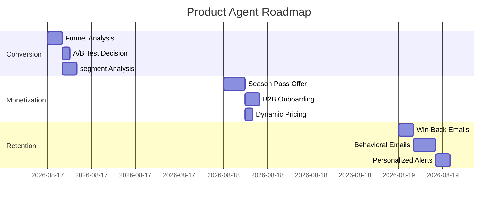

# PRODUCT_AGENT_PLAN.md — Conversion & Monetization Strategy

> **Agent**: product_agent
> **Role**: `.ai/roles/product-agent.md`
> **Priority**: P0-P1
> **Status**: [~] in_progress by product_agent
> **Handoff**: growth_agent, ui_ux_agent, univers_motion_agent

---

## 🎯 Mission
Maximize conversion (0.009% → 0.02%) and ARPU through data-driven product decisions while preserving the honesty moat.

### KPIs
- **Primary**: Funnel conversion rate (map → beach → paywall → paid)
- **Secondary**: ARPU, retention (7d/30d), B2B trial→paid
- **Guardrails**: Bundle ≤210 Ko, no fake data, reduced-motion compliance

---

## 📊 Phase 1: Conversion Audit (P1 - 2h)
**Agent**: product_agent + growth_agent

### Tasks
1. **Funnel Analysis**
   - Source: `scripts/automation/data/funnel-daily-report.json`
   - Metrics: `sg_map_open`, `sg_beach_click`, `sg_premium_modal_open`, `sg_pass_cta`, `sg_conversion`
   - Tool: `scripts/analyze-funnel.cjs`
   - Output: `.ai/agent_plans/funnel_analysis_2026-08-17.md`

2. **Comic vs World Paywall A/B Test**
   - Source: `abVariant("pw_style", ["world", "comic"])` in `Sargasses_PROD.jsx:14280`
   - Metrics: CTR, conversion rate, bounce rate
   - Decision: Kill switch if Comic < World (hardcode "world")
   - Output: `.ai/decisions.md` entry

3. **Segment Analysis**
   - Segments: `getSegment()` (returning visitor, mobile, region, language)
   - Tool: `scripts/segment-funnel.cjs`
   - Output: `.ai/agent_plans/segment_analysis.md`

### Handoff
- **growth_agent**: Win-back email campaign (A10)
- **ui_ux_agent**: Paywall friction fixes (E1, E2, E4, E11)

---

## 💰 Phase 2: Monetization (P2 - 3h)
**Agent**: product_agent + data_agent

### Tasks
1. **Season Pass Offer**
   - Task: Add season pass to `PassOffer.jsx` (E18)
   - Pricing: 1999 cents (210 days) vs 1499 cents (30 days)
   - Positioning: "Unlimited alerts for the season" vs "30-day pass"
   - Output: PR `#season-pass-offer`

2. **B2B Onboarding Checklist**
   - Task: Implement A5 (post-trial checklist)
   - Components: `PremiumModal.jsx:543-557` + Supabase `b2b_trials` table
   - Output: `.ai/agent_plans/b2b_onboarding.md`

3. **Dynamic Pricing**
   - Task: Seasonal surcharge (E3) + USD pricing
   - Logic: `new Date().getMonth() >= 5 && new Date().getMonth() <= 11`
   - Output: `scripts/dynamic-pricing.cjs`

### Handoff
- **data_agent**: Propensity model (F8)
- **univers_motion_agent**: Season pass comic variant

---

## 📈 Phase 3: Retention (P2 - 4h)
**Agent**: product_agent + growth_agent

### Tasks
1. **Win-Back Emails**
   - Segment: `expires_at < now() AND email IS NOT NULL` (Supabase)
   - Template: `B2C_NARRATIVE.md` + `B2B_EMAIL_TEMPLATE.md`
   - Tool: `scripts/winback-email.cjs`
   - Output: `.ai/agent_plans/winback_campaign.md`

2. **Behavioral Emails**
   - Events: `sg_premium_activated`, `sg_forecast_view`, `sg_alert_triggered`
   - Sequences: 7d (first alert), 30d (retention), 90d (upsell)
   - Output: `scripts/automation/drip-email.cjs`

3. **Personalized Alerts**
   - Task: F6 (ML on existing forecast)
   - Tool: `scripts/personalized-alerts.cjs`
   - Output: OneSignal segments + templates

### Handoff
- **growth_agent**: Deliverability monitoring
- **data_agent**: Alert accuracy backtest

---

## 🎨 Phase 4: Univers & Motion (P3 - 6h)
**Agent**: univers_motion_agent (handoff from product_agent)

### Tasks
1. **Season Pass Comic Variant**
   - Task: Design comic variant for season pass
   - Source: `design/STORY/03-MOTIF-KIT.md`
   - Output: `src/assets/comic-season-pass.svg`

2. **AI-Generated Briefs**
   - Task: F9 (daily video briefs)
   - Tool: `video-brief` skill
   - Output: `public/video-briefs/2026-08-17.mp4`

3. **Yole Martinique Easter Egg**
   - Task: TASK-P2-005c (SVG animation)
   - Source: `design/STORY/03-MOTIF-KIT.md`
   - Output: `src/components/YoleEasterEgg.jsx`

### Handoff
- **ui_ux_agent**: Integration into paywall
- **coding_agent**: Easter egg wiring

---

## 📅 Timeline

---

## 🔄 Handoff Protocol
1. **To growth_agent**
   - File: `.ai/agent_plans/growth_agent_handoff.md`
   - Content: Funnel analysis + win-back campaign specs

2. **To ui_ux_agent**
   - File: `.ai/agent_plans/ui_ux_handoff.md`
   - Content: Paywall friction fixes + comic variants

3. **To univers_motion_agent**
   - File: `.ai/agent_plans/univers_motion_handoff.md`
   - Content: Season pass comic + AI briefs specs

---

## 📌 Rollback Flags
| Feature               | Flag               | Default | Rollback Command               |
|-----------------------|--------------------|---------|---------------------------------|
| Comic Paywall         | `?pwcomic=0`      | 1       | `abVariant("pw_style", "world")` |
| Season Pass           | `?season_pass=0`  | 1       | Remove from `PassOffer.jsx`     |
| Dynamic Pricing       | `?dynamic_price=0`| 1       | Hardcode EUR pricing            |
| Win-Back Emails       | `?winback=0`      | 1       | Disable campaign                |

---

## ✅ Definition of Done
- [ ] Funnel analysis documented in `.ai/agent_plans/funnel_analysis_2026-08-17.md`
- [ ] A/B test decision recorded in `.ai/decisions.md`
- [ ] Season pass offer implemented and tested (Playwright)
- [ ] Win-back email campaign deployed (Resend)
- [ ] Handoff files created for growth_agent, ui_ux_agent, univers_motion_agent